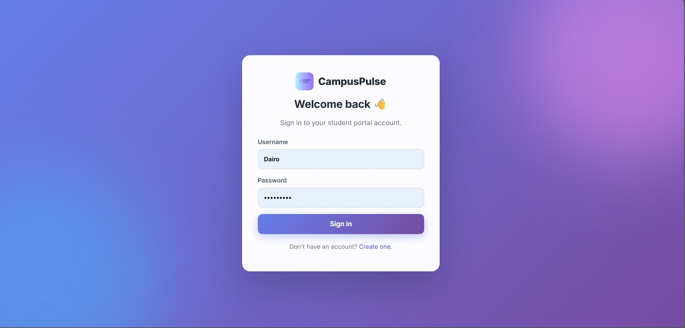
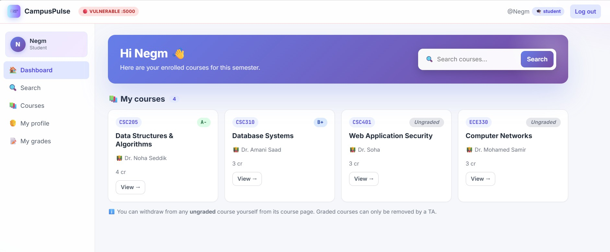
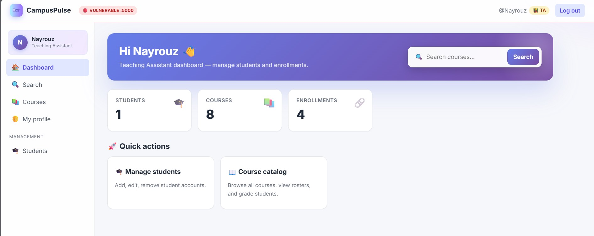
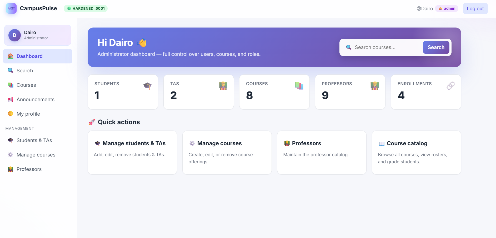

<p align="center">
  
</p>

<h1 align="center">🛡️ CampusPulse-Shield</h1>

<p align="center">
  🎯 Chained Vulnerability Lab • 🐞 SQLi → 💉 Reflected XSS → 🪤 CSRF • 🧪 Vulnerable vs 🟢 Hardened Builds
  <br/>
  🎓 <em>Course Project — Cyber Security</em>
  <br/>
  🔗 Based on the original <a href="https://github.com/Negm24/CampusPulse">CampusPulse</a> student-portal project (Web Development course).
</p>

---

> 🛡️ A security-focused rewrite of CampusPulse, built to demonstrate a live attack chain that escalates a regular student account into an admin — and to prove the same chain is blocked once standard mitigations are in place.

---

# 🧠 Overview

**CampusPulse-Shield** is a university student-portal web application engineered as a *deliberate* security lab. It ships in two parallel deployments:

- 🔴 **Vulnerable Build** — contains three real, exploitable flaws, chained end-to-end.
- 🟢 **Hardened Build** — same UI, same features, but every flaw is patched using the textbook fix.

Run both side-by-side. Attack the red one. Watch the same attack die against the green one.

The lab demonstrates the full **Chained Vulnerability** scenario:

> 🔍 **SQL Injection** (recon) → 💉 **Reflected XSS** (delivery) → 🪤 **CSRF + Mass-Assignment** 
>
> End goal: a low-privilege student promotes themselves to **admin** without ever knowing the admin's password.

---

# ✨ Highlights

## 🎯 Three Vulnerabilities, One Chain

- 🔍 **Stage 1 — SQL Injection** on the course search bar leaks the admin's username & email via a `UNION SELECT` from the `users` table.
- 💉 **Stage 2 — Reflected XSS** delivers a script payload via a crafted search URL the admin clicks.
- 🪤 **Stage 3 — CSRF + Mass-Assignment** silently fires a `POST /admin/users/set-role` from inside the admin's session. The endpoint accepts whatever role the form sends — including `admin`, even though the UI only ever exposes `student` / `ta`.

## 🛡️ Three Mitigations, Textbook-Clean

- ✅ Parameterized queries (`?` placeholders) replace string concatenation.
- ✅ Jinja2 auto-escaping + strict **Content-Security-Policy** header for any user-controlled data.
- ✅ Per-session CSRF tokens on every state-changing form + `SameSite=Lax` session cookies + **role whitelist** (`{'student','ta'}`) on the role-set endpoint.

## 🧪 Two-State Deployment

- 🔴 **Vulnerable** runs on `http://localhost:5000`
- 🟢 **Hardened** runs on `http://localhost:5001`
- Same database schema, same seed users, same UI — only the security posture differs.

---

# 🏗️ System Architecture

```txt
        ┌─────────────────────────────────────────────────────┐
        │              🌐 Browser (Attacker / Admin)          │
        └───────────────┬─────────────────────┬───────────────┘
                        │                     │
            (1) Attack  ▼                     ▼  (2) Same Attack
        ┌────────────────────────┐   ┌────────────────────────┐
        │  🔴  VULNERABLE BUILD  │   │  🟢  HARDENED BUILD    │
        │      :5000             │   │      :5001             │
        ├────────────────────────┤   ├────────────────────────┤
        │  Flask (Jinja2)        │   │  Flask (Jinja2)        │
        │  Session Cookies       │   │  Session + CSRF Tokens │
        │  Raw SQL (concat)      │   │  Parameterized SQL     │
        │  Unescaped echo        │   │  Escaped + CSP header  │
        │  No CSRF protection    │   │  Token + SameSite=Lax  │
        │  No role whitelist     │   │  Role whitelist        │
        └───────────┬────────────┘   └───────────┬────────────┘
                    │                            │
                    ▼                            ▼
            ┌─────────────────┐          ┌─────────────────┐
            │ 🗄️ SQLite       │          │ 🗄️ SQLite       │
            │ campuspulse.db  │          │ campuspulse.db  │
            └─────────────────┘          └─────────────────┘
```

Each build is a self-contained Flask app. They are intentionally independent — no shared code — so reviewers can `diff vulnerable/ mitigated/` and see exactly which lines flipped from unsafe to safe.

---

# 🛠️ Technologies Used

| Layer            | Technology                            | Why                                                              |
| ---------------- | ------------------------------------- | ---------------------------------------------------------------- |
| **Backend**      | Python 3.10+ • Flask 3                | Minimal, transparent — every route is one short function.        |
| **Templating**   | Jinja2 (server-rendered)              | Required for a clean Reflected-XSS demo.                         |
| **Database**     | SQLite + `sqlite3` (raw)              | Raw SQL is what makes SQLi demonstrable & the fix meaningful.    |
| **Sessions**     | Flask signed cookies (`SameSite=Lax`) | Required for the CSRF demo; JWT/localStorage wouldn't work.      |
| **Hashing**      | `werkzeug.security` (PBKDF2)          | Real password hashing even in the vulnerable build.              |
| **Frontend**     | Hand-written HTML / CSS / minimal JS  | No framework bloat — every line is auditable.                    |
| **Attack tools** | Browser DevTools • `curl` • Burp Suite | Standard demonstration tooling.                                  |

---

## 🔁 What's different vs. the original CampusPulse?

> The [original CampusPulse](https://github.com/Negm24/CampusPulse) is a feature-rich student-portal project built for a **Web Development** course. CampusPulse-Shield is a deliberately simpler derivative built for a **Cyber Security** course, where the goal is to *demonstrate vulnerabilities*, not ship features. The architecture was changed where it was necessary for the security demo to be honest and clean.

| Aspect             | 🟦 Original CampusPulse           | 🛡️ CampusPulse-Shield                            | Reason for the change                                                                       |
| ------------------ | --------------------------------- | ------------------------------------------------ | ------------------------------------------------------------------------------------------- |
| Frontend           | React 19 + Axios                  | Server-rendered Jinja2 + plain HTML/CSS          | React auto-escapes everything → Reflected XSS would have to be faked.                       |
| Backend            | Flask REST API (JSON)             | Flask server-rendered pages                      | Same framework; switching to HTML makes the XSS sink real.                                  |
| Database           | MySQL + SQLAlchemy ORM            | SQLite + raw `sqlite3`                           | ORM auto-parameterizes — SQLi can't be demonstrated. Raw SQL makes the vuln & the fix real. |
| Auth / Sessions    | JWT in `localStorage`             | Signed session cookies                           | CSRF *requires* cookie auth. Tokens in `localStorage` aren't auto-sent and can't be CSRF'd. |
| Domain model       | Groups, posts, comments           | Students, TAs, courses, professors, enrollments, grades | Scope-realistic for an academic portal; everything the chained attack needs.        |
| Build process      | `npm install` + MySQL + `.env`    | `pip install` + `python seed.py` + `python run.py` | Zero-friction for graders & teammates to spin up.                                          |
| Deployment count   | One build                         | **Two** parallel builds (vulnerable + hardened)  | Required by the project brief — live attack must succeed on one and fail on the other.     |

**Both projects share:** the CampusPulse name, brand, color palette, the "student portal" domain, and clean separation between routes, data, and views.

---

# 👤 Role Model

The portal has three roles with a strict hierarchy:

| Role | Can do…                                                                                                     | Can NOT do                                                            |
| ---- | ----------------------------------------------------------------------------------------------------------- | --------------------------------------------------------------------- |
| 🎓 **Student** | View & edit own profile · view own grades & GPA · search the catalog · self-withdraw from **ungraded** courses | See other students' grades · grade anyone · manage other accounts |
| 🧑‍🏫 **TA**     | Add / edit / remove students · manage course enrollments · view grades (read-only) · withdraw **ungraded** students | Grade or edit grades · withdraw **graded** students · manage TAs / courses / professors / role changes |
| 👑 **Admin**   | Everything a TA can do · **grade & edit grades** · withdraw **any** enrollment (graded or not) · promote/demote students ↔ TAs · CRUD courses · CRUD professors | Be demoted by anyone (Dairo is the sole admin)                        |

> Once a grade is recorded, the enrollment is **locked**:
> - Students cannot self-withdraw.
> - TAs cannot withdraw the student.
> - Only the admin can withdraw a graded enrollment (and only the admin can edit / clear the grade).

---

# 📚 Feature Set

## 🔍 Search & Catalog
- Course search by code or title (this is the SQLi sink in the vulnerable build)
- Course catalog with per-course enrollment count + lecturer count
- Course detail page with the enrolled-students roster, the per-student lecturer assignment, and inline grade editor (admin)

## 👨‍🏫 Multi-Lecturer Courses
- A `professors` table + `course_professors` many-to-many join
- A course can be **co-taught** by multiple professors
- When enrolling a student into a co-taught course, the TA/admin must pick the **specific lecturer**
- Admin can CRUD professors via `/admin/professors`

## 📝 Grading & GPA
- Letter grades: `A+, A, A-, B+, B, B-, C+, C, C-, D+, D, F` (and "Ungraded")
- **Admin-only** grading; TAs see grades read-only
- **GPA** on a 4.0 scale, weighted by credit hours:
  - Students: live-computed from current grades
  - TAs: stored **pre-graduation GPA** in `users.gpa` 
  - Admins: N/A
- `/my-grades` page for each student with a gradient GPA hero card and a per-course point breakdown (`grade_points × credits = total`)

## 👤 Editable Profile
- Each user can edit their own full name, email, major, year, bio, and password
- Username is read-only
- Year is locked to "Faculty" for TAs/admins; students get a dropdown of Year 1–5

## 🔐 Self-Service Enrollment Control
- Students can **self-withdraw** from any **ungraded** course they're enrolled in
- Graded courses are locked from self-withdrawal (UI replaces the button with a 🔒 indicator)

---

# 🗄️ Database Schema

5 tables — all in one SQLite file regenerated by `seed.py`:

```sql
users (
    id, username UNIQUE, email UNIQUE, password_hash,
    role          CHECK IN ('student','ta','admin'),
    full_name, bio, major, year,
    gpa           REAL                       -- TA pre-grad GPA; NULL for others
)

professors (
    id, name UNIQUE
)

courses (
    id, code UNIQUE, title, description, credits
)

course_professors (                          -- many-to-many: who teaches what
    course_id, professor_id, PRIMARY KEY (course_id, professor_id)
)

enrollments (                                -- student ↔ course
    user_id, course_id,
    professor_id,                            -- which lecturer the student is with
    grade,                                   -- A+ … F or NULL (ungraded)
    PRIMARY KEY (user_id, course_id)
)
```

---

# 🚀 Quick Start

> Requires **Python 3.10+**. Nothing else — no Node, no MySQL, no Docker.

### 1️⃣ Clone

```bash
git clone https://github.com/<MohamedEldairouty>/CampusPulse-Shield.git
cd CampusPulse-Shield
```

### 2️⃣ Run the vulnerable build 🔴

```bash
cd vulnerable
python -m venv .venv
.venv\Scripts\activate           # Windows (PowerShell)
# source .venv/bin/activate      # macOS / Linux
pip install -r requirements.txt
python seed.py                    # creates campuspulse.db with seed data
python run.py                     # http://localhost:5000
```

### 3️⃣ Run the hardened build 🟢 (in a second terminal)

```bash
cd mitigated
python -m venv .venv
.venv\Scripts\activate
pip install -r requirements.txt
python seed.py
python run.py                     # http://localhost:5001
```

### 4️⃣ Default seed accounts

| Role         | Username  | Password      | Notes                                  |
| ------------ | --------- | ------------- | -------------------------------------- |
| 👑 Admin     | `Dairo`   | `Dairo123!`   | The sole admin                         |
| 🧑‍🏫 TA      | `Mariam`  | `Mariam123!`  | Pre-grad GPA: 4.00                     |
| 🧑‍🏫 TA      | `Nayrouz` | `Nayrouz123!` | Pre-grad GPA: 4.00                     |
| 🎓 Student   | `Negm`    | `Negm123!`    | Pre-enrolled in 4 courses            |

> The attacker plays as **Negm** and ends the demo with `Negm` promoted to **admin** — without ever knowing `Dairo123!`.

---

# 🎯 The Attack Chain (at a glance)

| Stage | Vulnerability              | Where it lives                       | What the attacker gets                                |
| ----- | -------------------------- | ------------------------------------ | ----------------------------------------------------- |
| 1️⃣   | 🔍 SQL Injection           | `GET /search?q=...`                  | Admin's username & email exfiltrated from `users`     |
| 2️⃣   | 💉 Reflected XSS           | Search-results page echoes `q\|safe` | Arbitrary JS executes in admin's browser context      |
| 3️⃣   | 🪤 CSRF + Mass-Assignment  | `POST /admin/users/set-role`         | `Negm.role` flipped to `'admin'` in one POST          |

The hidden trick in stage 3: the admin UI only ever shows **Promote to TA** / **Demote to student** buttons (target_role ∈ {ta, student}). But the endpoint has no whitelist — when the XSS payload sends `target_role=admin`, the server happily writes it.

## 🥷 Alternative outcome — Quiet Grade Tampering

Stage 3 can be retargeted at the grading endpoint instead of the role endpoint. Same SQLi → XSS chain; the only difference is the URL the XSS payload calls:

| Aspect              | 🪤 Privilege Escalation (Loud)                 | 🥷 Grade Tampering (Quiet)                          |
| ------------------- | --------------------------------------------- | --------------------------------------------------- |
| Target endpoint     | `POST /admin/users/set-role`                  | `POST /courses/<id>/grade`                          |
| Form fields         | `target_id`, `target_role`                    | `student_id`, `grade`                               |
| Magic trick         | Mass-assign `target_role=admin` (not in UI)   | None — `A+` is already a legitimate value           |
| What the audit sees | A student suddenly becomes admin (loud)       | "Admin graded Negm: A+" — looks like a normal action |
| Visible UI fallout  | Admin sidebar appears for the attacker        | None — Negm just has better grades                  |

In a live test against the vulnerable build, Negm's GPA jumped from **3.53** → **3.67** in one POST — without ever touching admin's password or knowing the endpoint existed before reading the source.

**Both outcomes are blocked by the same mitigation** — the per-session CSRF token. The role whitelist is a defense-in-depth bonus that closes the privilege-escalation path even if a CSRF token ever leaks.

---

# 🛡️ Mitigation Summary

| Stage | Fix Applied in `mitigated/`                                                                              |
| ----- | -------------------------------------------------------------------------------------------------------- |
| SQLi  | Replace string interpolation with **parameterized queries** (`?` placeholders).                          |
| XSS   | Remove `\|safe` from every template + rely on **Jinja2 auto-escaping** + set a strict **CSP** header.    |
| CSRF  | Per-session **CSRF token** in every state-changing form + `SameSite=Lax` session cookie.                  |
| Mass-Assignment | The role-set endpoint validates `target_role` against a **whitelist** `{'student', 'ta'}` — `admin` is never reachable through it. |

All four together kill every stage of the chain — verified live via curl, browser, and the DB.

---

# 📸 Application Preview

## 🔐 Login page

<p align="center">
  
</p>

Login screen. On the mitigated build, the form carries a per-session CSRF token.

---

## 🏠 Dashboard — Same page, Three Roles

Each role lands on the *same* `/dashboard` URL but the content adapts to what they're allowed to see and do. From left to right: 🎓 Student · 🧑‍🏫 Teaching Assistant · 👑 Administrator.

<table>
  <tr>
    <td align="center" width="33%">
      <a href="assets/screenshots/dashboard-student.png">
        
      </a>
      <br/>
      <sub><b>🎓 Student — Negm</b></sub>
    </td>
    <td align="center" width="33%">
      <a href="assets/screenshots/dashboard-ta.png">
        
      </a>
      <br/>
      <sub><b>🧑‍🏫 TA — Nayrouz-Mariam</b></sub>
    </td>
    <td align="center" width="33%">
      <a href="assets/screenshots/dashboard-admin.png">
        
      </a>
      <br/>
      <sub><b>👑 Admin — Dairo</b></sub>
    </td>
  </tr>
  <tr>
    <td valign="top">
      Sees only their own enrolled courses with live <b>grade pills</b> per course, a quick-search bar, and a sidebar with <b>My profile</b> + <b>My grades</b> — no management links.
    </td>
    <td valign="top">
      Sees stat cards for <b>Students</b>, <b>Courses</b>, and <b>Enrollments</b>, plus management shortcuts. The TA count card is hidden — only the admin sees TA totals.
    </td>
    <td valign="top">
      Full panel: <b>Students</b>, <b>TAs</b>, <b>Courses</b>, <b>Professors</b>, <b>Enrollments</b>, plus shortcuts to manage all of them. Only the admin can grade students or change roles.
    </td>
  </tr>
</table>

---

# 👥 Team Members

| Member                                                                              | ID         | 
| ----------------------------------------------------------------------------------- | ---------- | 
| **[@Mohamed Abdallah Eldairouty](https://github.com/MohamedEldairouty)**            | 221001719  | 
| **[@Youssef Negm](https://github.com/Negm24)**                                      | 221011914  | 
| **Mariam Ashraf**                                                                   | 221002547  | 
| **Nayrouz Ahmed**                                                                   | 221011969  | 

---

# 🎥 Full Demo Video

A complete end-to-end walkthrough of the chained attack — vulnerable build executing the exploit, then the same payloads dying against the hardened build.

<p align="center">
  <a href="assets/demo/full-demo.mp4">
    
  </a>
</p>

---

# 📄 Technical Report

The full architecture, threat model, exploitation steps with payloads, and per-mitigation rationale are documented in the PDF report:

📖 [**docs/report.pdf**](docs/report.pdf)

---

# 📜 License

This project is developed for academic purposes only.
All rights reserved © CampusPulse-Shield Team 2026

---

<p align="center">
  🛡️ <strong>CampusPulse-Shield</strong> — Break it on purpose. Patch it on principle.
</p>
